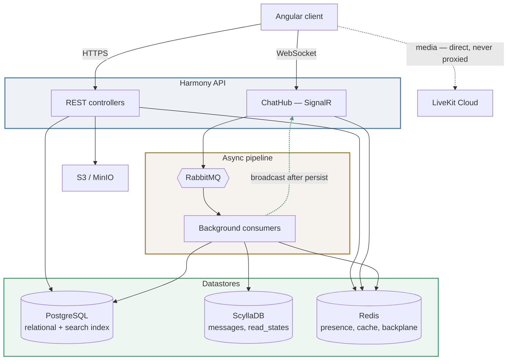
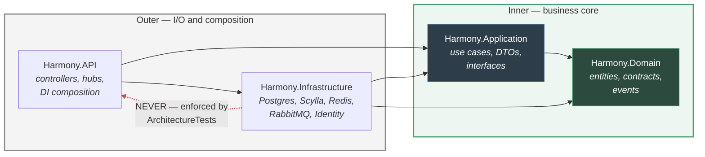
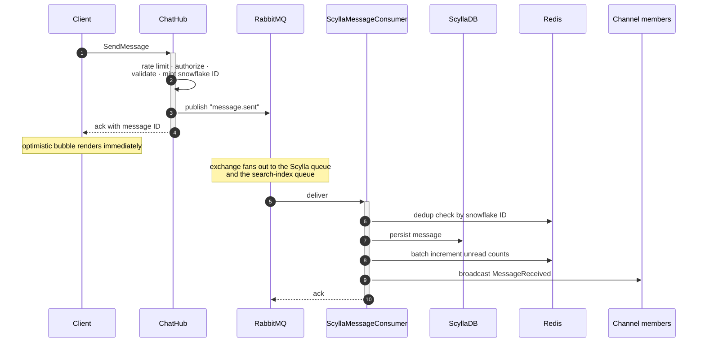
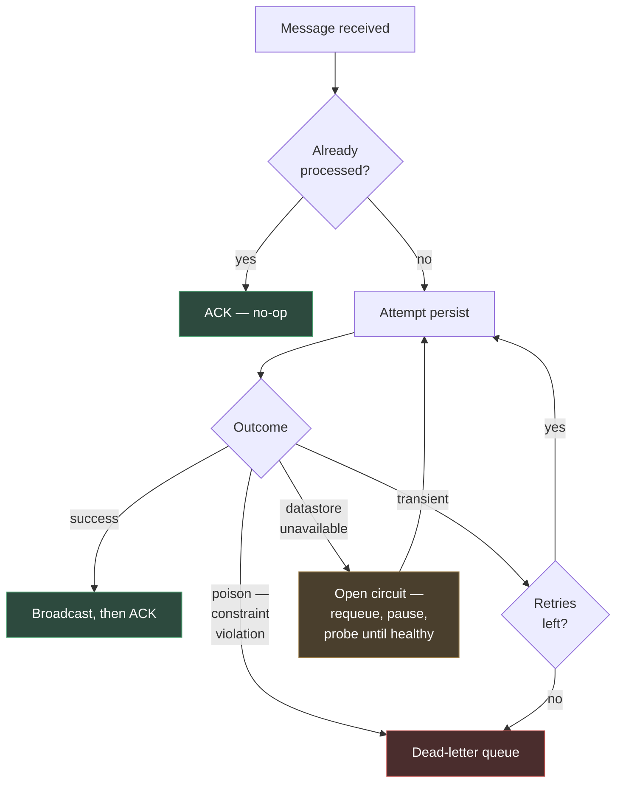

# Harmony API

Backend for **Harmony**, a real-time communication platform in the spirit of Discord — guilds,
channels, direct messages, voice/video, presence, and a full permission system.

The goal of this project is not a clone. It is a genuinely well-architected distributed system:
polyglot persistence with each store chosen for its access pattern, an asynchronous message pipeline
that survives datastore outages, and a permission model resolved at the channel level. It is built
to hold 10k+ concurrent users, and the design decisions are documented rather than implied.

Built with **ASP.NET Core on .NET 10**, following Clean Architecture.

---

## Stack

| Concern | Technology |
|---|---|
| API & real-time | ASP.NET Core 10, SignalR with a Redis backplane |
| Relational data | PostgreSQL via EF Core + Npgsql |
| Message history | ScyllaDB via the Cassandra driver (no ORM) |
| Cache & ephemeral state | Redis — presence, unread counts, typing, rate limits, dedup |
| Async pipeline | RabbitMQ — fan-out exchange, per-consumer queues, dead-letter queue |
| Voice & video | LiveKit (Cloud) |
| Object storage | S3-compatible — MinIO in dev, S3 in production |
| Auth | ASP.NET Core Identity + JWT, httpOnly refresh cookies, email 2FA, Google Sign-In |
| Resilience | Polly — retry ladders, circuit breakers |
| Observability | Serilog structured logging, health checks |
| Testing | xUnit, FluentAssertions, Moq |

---

## Architecture

### System topology



Media never passes through the API — clients connect to LiveKit directly, and the API only mints
scoped access tokens. Likewise, object storage is never exposed: all file access goes through
presigned URLs issued by the API.

### Why two databases

PostgreSQL holds everything relational and everything that needs transactions or joins: users,
guilds, roles, permission overrides, friendships, notifications, reactions.

ScyllaDB holds **messages and read states only**. Message history is an append-heavy, partition-by-
channel, read-by-time-range workload — exactly what a wide-column store is built for, and exactly
what a relational store degrades on at volume. There is no shared abstraction forced across the two;
each has its own repository layer.

Redis holds nothing durable. Presence, unread counters, typing indicators, rate limits, and the
SignalR backplane all live there — and unread counts specifically are treated as a **cache**, with
ScyllaDB `read_states` as the source of truth.

### Clean Architecture



The dependency rule points inward, always. `Harmony.Infrastructure` must **never** reference
`Harmony.API` — this is enforced by an automated architecture test, not by convention. Concrete
implementations depend on interfaces defined in the inner layers, and DI composition happens
exclusively at the API edge.

### The message pipeline

Sending a message is the system's most interesting path, and the one place where the architecture
earns its complexity. The hub does **not** broadcast — it publishes. The consumer broadcasts, and
only after the message is durably persisted.



This buys three things. The client gets a fast acknowledgement regardless of downstream load.
Persistence and broadcast cannot diverge — nobody sees a message that was never stored. And under
overload the system degrades into *latency*, not data loss: the queue absorbs the backlog.

Every message carries a **snowflake ID** (64-bit, time-ordered, epoch 2024-01-01), used everywhere in
place of UUIDs. Because they sort chronologically, the client orders the live stream by ID rather
than by arrival order — which means message ordering stays correct no matter how many API instances
are consuming concurrently.

### Failure handling

Consumers are the most dangerous code in the repository, so their failure paths are explicit:



Consumers are **idempotent**, deduplicating by snowflake ID, so a redelivery is always safe. A
message that can never succeed — a constraint violation, for instance — fails fast to the dead-letter
queue instead of retrying forever. A datastore that is merely *down* trips a circuit breaker that
requeues and replays once it recovers, so an outage delays messages rather than losing them. The
dead-letter queue depth is surfaced as a health check.

> **Deeper detail** lives in [`docs/`](docs/) — see the [repo map](#repo-map) below.

---

## Getting started

**Prerequisites:** .NET 10 SDK, Docker and Docker Compose.

```bash
# 1 — configure secrets
cd docker
cp .env.example .env      # then fill in the values, see Configuration below

# 2 — bring up the infrastructure
docker compose up -d
```

> ⏱️ **ScyllaDB and RabbitMQ take 60–90 seconds to report healthy.** This is normal. Wait for them
> before starting the API, or the first connection attempt will fail.

```bash
# 3 — apply database migrations
cd ..
dotnet ef database update --project src/Harmony.Infrastructure --startup-project src/Harmony.API

# 4 — run the API
dotnet run --project src/Harmony.API
```

The API listens on **http://localhost:5057**.

### Local service URLs

| Service | URL | Notes |
|---|---|---|
| API | http://localhost:5057 | |
| OpenAPI spec | http://localhost:5057/openapi/v1.json | Development only |
| Health check | http://localhost:5057/health | Anonymous; JSON payload per dependency |
| RabbitMQ management | http://localhost:15672 | Queue depths, DLQ inspection |
| MinIO console | http://localhost:9001 | Object browser |
| Mailpit | http://localhost:8025 | Catches all outbound dev email |

### Seeding development data

```bash
dotnet run --project tools/Harmony.DevSeed            # idempotent, safe to re-run
dotnet run --project tools/Harmony.DevSeed --reset    # rebuild the test guild
```

This provisions a test guild with members at **every permission tier** — owner, admin-role, plain
member, timed-out member, and one restricted by a channel override — plus channels including a
hidden one, and seeded messages. Most of it runs through the real HTTP API, so it doubles as a
pipeline smoke test. Log in as each seeded user in separate browser profiles to exercise the
permission stack.

Requires the full Docker stack **and** a running API.

---

## Testing

```bash
dotnet test                                              # everything
dotnet test tests/Harmony.UnitTests                      # fast, no dependencies
dotnet test tests/Harmony.IntegrationTests               # needs the Docker stack
```

Integration tests run against the real stack — real Postgres, real Scylla, real RabbitMQ, real Redis,
real MinIO — not in-memory fakes. They are slower, and they catch things fakes never would.

> ⚠️ **Kill any stray `dotnet run` API before running integration tests.** A running API is a
> competing consumer on the same RabbitMQ queues and will steal the tests' messages, producing
> confusing timeouts rather than clean failures. See the [FAQ](#faq--troubleshooting).

Load tests live in [`load-tests/`](load-tests/) — a k6 harness that speaks the SignalR protocol
directly. See its own README.

---

## Project layout

```
src/
  Harmony.API              controllers, hubs, filters, DI composition, Program.cs
  Harmony.Infrastructure   Postgres, Scylla, Redis, RabbitMQ, Identity, storage
  Harmony.Application      use cases, DTOs, interfaces, hub contracts
  Harmony.Domain           entities, repository contracts, domain events

tests/
  Harmony.UnitTests        isolated, mocked
  Harmony.IntegrationTests full stack, real dependencies

tools/
  Harmony.DevSeed          development data seeder — deliberately outside the solution

docker/                    local infrastructure stack
load-tests/                k6 performance harness
```

`Harmony.DevSeed` is intentionally **not** in the solution file, so CI and `dotnet test` ignore it.

---

## Configuration

Configuration is layered: `appsettings.json` → `appsettings.{Environment}.json` → user-secrets
(local) → environment variables (deployed). Environment variables win.

Secrets required in `docker/.env` — see `.env.example`:

| Variable | Purpose |
|---|---|
| `POSTGRES_PASSWORD` | PostgreSQL |
| `RABBITMQ_PASSWORD` | RabbitMQ |
| `Jwt__Key` | JWT signing key — use a long random value |
| `MINIO_ACCESS_KEY` / `MINIO_SECRET_KEY` | Object storage |
| `LIVEKIT_KEY` / `LIVEKIT_SECRET` | LiveKit Cloud credentials |

**No real credentials are committed to this repository.** `appsettings.json` ships empty
placeholders. For local development the LiveKit pair is best supplied via .NET user-secrets rather
than a file:

```bash
dotnet user-secrets set "LiveKit:ApiKey" "..." --project src/Harmony.API
dotnet user-secrets set "LiveKit:ApiSecret" "..." --project src/Harmony.API
```

Notable non-secret settings: `RateLimiting:Enabled` (defaults to **true** — an unset key must never
mean unprotected), `Cors:AllowedOrigins`, `Jwt:AccessTokenExpiryMinutes`.

---

## FAQ / Troubleshooting

**Integration tests time out waiting for messages.**
A stray `dotnet run` API is consuming the RabbitMQ queues in parallel with the tests. Kill it. You
can confirm the diagnosis in the RabbitMQ management UI — the queue will show more consumers than it
should.

**The stack "starts" but the API can't connect on first run.**
ScyllaDB and RabbitMQ take 60–90 seconds to become healthy. `docker compose ps` reports the real
state; wait for healthy before starting the API.

**I added or changed a column and the test suite suddenly 500s everywhere.**
The test database is built once via `EnsureCreated` and does not run migrations. After any schema
change, **drop `harmony_test`** so it is rebuilt. Adding a column or making one nullable both require
this; removing a column alone does not. CI is unaffected — it gets a fresh database every run.

**Same thing, but for ScyllaDB.**
Table creation uses `CREATE TABLE IF NOT EXISTS`, which is a no-op against an existing table — so a
new column silently never appears. Drop and recreate the local keyspace.

**Messages send but never appear, and nothing is in the dead-letter queue.**
Check whether ScyllaDB is actually up. The write-side circuit breaker requeues and pauses rather than
dead-lettering, so a Scylla outage looks like silence, not errors. `/health` will tell you directly.

**There are messages sitting in the dead-letter queue.**
On a development box these are almost always integration-test residue — dev and test share a broker,
and a test that ends before a retry completes leaves a row behind. Inspect the payload and the
`x-death` header before assuming it is a real fault. Purging is safe:

```bash
docker exec harmony-rabbitmq-1 rabbitmqctl purge_queue harmony.dead-letter.queue
```

**Load-test results look wrong or wildly inconsistent.**
Three things invalidate a run silently: a previous run's backlog still draining (purge
`harmony.messages.scylla` first), expired seed tokens (re-seed before each run), and a stray API
competing for the queue. Note also that `docker stats` does not show the API or k6 — both run on the
host, and they are usually the two largest CPU consumers.

**Why doesn't the hub broadcast the message directly? It would be faster.**
It would also allow clients to see messages that were never persisted, if the write subsequently
failed. Broadcasting from the consumer after persistence makes the two impossible to diverge. This is
a deliberate architectural constraint, not an oversight.

**Why are consumers single-threaded?**
`ConsumerDispatchConcurrency` is deliberately left at 1. Ordering is instead guaranteed on the client,
which sorts by snowflake ID — so correctness does not depend on dispatch concurrency or instance
count, and the system can scale horizontally without reordering messages.

---

## Repo map

| Path | Contents |
|---|---|
| [`docs/adr/`](docs/adr/) | Architecture decision records — the load-bearing decisions and the alternatives they beat |
| [`docs/architecture-map.md`](docs/architecture-map.md) | Resiliency patterns, background services, store map |
| [`docs/database-schemas.md`](docs/database-schemas.md) | PostgreSQL and ScyllaDB schemas |
| [`docs/redis-and-events.md`](docs/redis-and-events.md) | Redis key map, SignalR events, permission bits |
| [`docs/application-flows.md`](docs/application-flows.md) | End-to-end feature flows |
| [`load-tests/`](load-tests/) | k6 harness and performance methodology |

---

## Development workflow

Branch from `develop` → `feature/*` → pull request → CI must pass → squash merge.

CI provisions PostgreSQL, ScyllaDB, RabbitMQ, Redis, and MinIO as real services and runs both test
suites against them.
